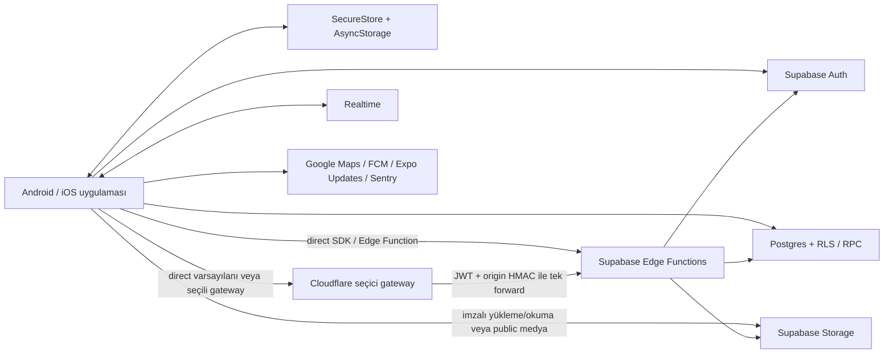

# SoRita ağ ve veri envanteri

Tarih: 2026-08-30
Durum: Kaynak sözleşmeleri `VERIFIED (STATIC)`; gerçek ortam uçları, secrets, dağıtımlar ve veri akışı `UNVERIFIED`; production cutover `NO-GO`.

## Güven sınırları

Cloudflare genel uygulama proxy'si değildir. `gateway` modunda yalnız beş seçili mobil Edge Function `/v1/<function>` yoluna gider; diğer Supabase Auth/PostgREST/RPC/Realtime/Storage trafiği doğrudan kalır. `direct` varsayılandır ve gateway hatasında otomatik direct fallback yoktur. Kaynak: [edgeFunctions.ts](../src/mobile/app/platform/api/edgeFunctions.ts) ve [publicRuntimeConfig.ts](../src/mobile/app/platform/config/publicRuntimeConfig.ts).

## İstemci ağ çıkışları

| Hedef | Amaç/veri | Kimlik/yetki | Kaynak durumu | Runtime durumu |
| --- | --- | --- | --- | --- |
| Supabase Auth | Session restore/validate/refresh, auth callback, logout ve kullanıcı yönetimi | Publishable key, refresh/access token; auth oturumu SecureStore'da | `VERIFIED (STATIC)` | `UNVERIFIED` |
| Supabase PostgREST/RPC | Profil, liste, mekân, sosyal grafik, yorum, bildirim, rapor ve read model verisi | Kullanıcı JWT + RLS | `VERIFIED (STATIC)` | `UNVERIFIED` |
| Supabase Realtime | Kullanıcıya ait bildirim kanalı | Kullanıcı JWT ve kanal politikası | `VERIFIED (STATIC)` | `UNVERIFIED` |
| Supabase Storage | Public profil/mekân medyası; private mekân medyası için imzalı URL; imzalı doğrudan upload | JWT, Edge Function tarafından verilen kısa ömürlü sözleşme | `VERIFIED (STATIC)` | `UNVERIFIED` |
| Supabase Edge Functions | Auth, hesap silme, geocoding, medya varlıkları, moderasyon ve yönetim yayını | Eyleme göre public/JWT; request ID, cihaz kimliği, imza/idempotency | `VERIFIED (STATIC)` | `UNVERIFIED` |
| Cloudflare Worker | Seçili beş Edge Function önünde boyut/şema/JWT/rate-limit/CORS/origin-HMAC katmanı | JWT veya dar public auth eylemi; Worker secrets | `VERIFIED (STATIC)` | `NO-GO` — dağıtılmamış placeholder config |
| Google Maps SDK/Static Maps | Harita, konum görünümü, mini harita görseli ve harici harita araması | Platform/statik Maps anahtarları | `VERIFIED (STATIC)` | `UNVERIFIED` |
| Firebase Cloud Messaging | Cihaz tokenı, doğrudan push ve sistem topic aboneliği | Native Firebase yapılandırması | `VERIFIED (STATIC)` | `UNVERIFIED` |
| Expo Updates/EAS | Runtime `appVersion` uyumlu OTA kontrolü ve yayın | Expo proje kimliği/CI secrets | `VERIFIED (STATIC)` | `UNVERIFIED` |
| Sentry | Hata/telemetri; yalnız DSN/yapılandırma sağlanırsa | DSN ve opsiyonel build plugin ayarları | `VERIFIED (STATIC)` | `UNVERIFIED` |
| Kullanıcı menü URL'leri | Mekân kartındaki doğrulanmış HTTPS bağlantısını işletim sisteminde açma | Kullanıcı kontrollü harici hedef | `VERIFIED (STATIC)` | Hedef alan adları değişken; `UNVERIFIED` |

Secret veya token değerleri bu envantere yazılmaz. `.env`, platform hizmet dosyaları ve credential dosyalarının varlığı geçerli, kısıtlı veya production'a uygun kimlik bilgisi kanıtı değildir.

## Edge Function sözleşmeleri

| Fonksiyon | Mobil | Mevcut amaç |
| --- | --- | --- |
| `auth-gateway` | Evet | Kullanılabilirlik, login/register, doğrulama yeniden gönderme, parola sıfırlama ve kimliği doğrulanmış auth eylemleri |
| `delete-user` | Evet | Mevcut hesap silme sagasını başlatma/devam ettirme |
| `maps-geocoding` | Evet | Mevcut harita/konum için kontrollü geocoding |
| `media-assets` | Evet | Upload/read URL üretimi, tamamlama ve silme; medya baytı gateway'den geçmez |
| `moderation-reports` | Evet | Mevcut kullanıcı/liste/mekân/yorum raporları |
| `admin-broadcast-notification` | Hayır | Mevcut sistem duyurularının yönetim/operasyon yayını |

Mobil edge taşıyıcısı tek `POST` yapar; varsayılan zaman aşımı 15 saniye, izin verilen üst sınır 60 saniye, hata gövdesi sınırı 16 KiB'dir. Başarı şeması çağrı bazında doğrulanabilir. `Retry-After` bilgisi üst katmana taşınır; genel taşıyıcı otomatik retry veya gateway→direct fallback yapmaz. Medya modülü kendi dar, idempotent/geçici hata retry politikasına sahiptir; bu genel Edge Function garantisi olarak yorumlanmamalıdır.

## Seçici Cloudflare Worker sözleşmesi

[Cloudflare Worker README](../infra/cloudflare/sorita-edge/README.md) ve [contracts.ts](../infra/cloudflare/sorita-edge/src/contracts.ts) içindeki exact rotalar:

| Rota | Metot | Azami JSON | Origin |
| --- | --- | ---: | --- |
| `/health` | `GET` | Yok | Yok |
| `/v1/auth-gateway` | `POST` | 32 KiB | `auth-gateway` |
| `/v1/maps-geocoding` | `POST` | 4 KiB | `maps-geocoding` |
| `/v1/moderation-reports` | `POST` | 8 KiB | `moderation-reports` |
| `/v1/media-assets` | `POST` | 64 KiB | `media-assets` |
| `/v1/delete-user` | `POST` | 1 KiB | `delete-user` |

Worker; asimetrik Supabase JWT doğrulaması, bounded JSON, exact method/path/action/schema, HMAC-hash'li rate-limit anahtarı, no-store yanıt, güvenli log alanları ve origin HMAC sağlar. Mutasyon origin'e bir kez iletilir. Media `upload`/`fileBase64` reddedilir; baytlar imzalı URL ile doğrudan Storage'a gider.

Ancak [wrangler.jsonc](../infra/cloudflare/sorita-edge/wrangler.jsonc) halen `.invalid` origin'ler, `replace-*-project-ref` URL'leri, placeholder namespace ID'leri ve production için `workers_dev` içerir. README açıkça deploy yapılmadığını belirtir. Gerçek secrets, özel domain/WAF, HMAC gözlem→enforcement sırası ve origin bypass koruması kanıtlanmadığı için Cloudflare durumu `NO-GO`dur.

## Sunucu veri envanteri

Postgres ve Storage nihai kaynak kabul edilir; istemci cache'i nihai kaynak değildir.

Ürün tabloları:

- Sosyal grafik: `public.follow_requests`, `public.user_follows`, `public.user_blocks`.
- Liste/mekân: `public.lists`, `public.list_places`, `public.list_place_photos`, `public.list_likes`, `public.list_place_likes`.
- Yorum: `public.list_place_comments`, `public.list_place_comment_likes`, `public.list_place_comment_reports`.
- Moderasyon/rapor: `public.moderation_reports`, `public.list_reports`, `public.list_place_reports`, `public.user_reports`.
- Kullanıcı/iletişim: `public.profiles`, `public.notifications`, `public.user_push_tokens`.

İç operasyon tabloları:

- `private.auth_login_guards`
- `private.edge_rate_limits`
- `private.push_delivery_jobs`
- `private.system_broadcast_deliveries`
- `public.account_deletion_jobs`
- `public.request_nonces`

Storage kovaları:

- `profile-media`: profil ve kapak medyası.
- `place-media`: public mekân medyası.
- `place-media-private`: yetkili imzalı okuma gerektiren özel mekân medyası.

Tam makine okunur liste snapshot'tadır. Migration geçmişi [supabase/migrations](../supabase/migrations) altında, SQL güvenlik/RLS kontrolleri [rls_and_security.sql](../supabase/tests/rls_and_security.sql) içindedir. Kaynakların bulunması, migration'ların yerel veya canlı ortamda uygulandığını kanıtlamaz: `UNVERIFIED`.

## Read model/RPC veri yolları

Repository katmanında mevcut ekranlar için sayfalı/read-model sözleşmeleri kullanılır: ana akış, keşif, profil özeti/içeriği, bildirim listesi/okunmamış sayısı, liste detay başlığı/mekân sayfası, konum kartları ve yorum sayfaları. Atomik beğeni/takip/yorum ve mekân-medya güncelleme RPC'leri mevcut kullanıcı eylemlerini güvenli hale getirir. İsim ve uygulama ayrıntısında migration/repository kaynakları belirleyicidir; bu belge yeni RPC yüzeyi tanımlamaz.

## Cihazda tutulan veri

| Depo | Veri sınıfı | Sınır/temizleme |
| --- | --- | --- |
| Expo SecureStore | Auth session ve cihaz kimliği | Gizli veri AsyncStorage'a fallback edilmez; logout ve session temizliğinde auth session silinir |
| AsyncStorage kullanıcı cache'leri | Görünür snapshot, entity cache, screen index/startup query cache | Kullanıcı kimliğiyle adlandırılır; TTL/boyut/adet sınırları vardır; kullanıcı geçişinde purge edilir |
| AsyncStorage outbox | Sekiz izinli yazma türünün payload referansı, bağımlılığı, deneme zamanı ve idempotency anahtarı | Kullanıcı kapsamlı, seri yazım; auth sınırında purge |
| AsyncStorage taslak/durum | Liste düzenleme taslağı, harita ekranı, navigation state, UI ipuçları, legal consent, pending signup media, auth redirect state | İlgili akışın yaşam döngüsünde silinir; kullanıcıya ait olanlar kullanıcı kimliğiyle sınırlandırılmalıdır |
| Bellek | React Query cache, Realtime kanalları, özel imzalı URL cache/in-flight işler | Logout/kullanıcı değişiminde merkezi purge; imzalı URL en çok 4 dakika cache |

Kalıcı startup query cache en fazla 7 query ve 1 MB tutar, sonsuz sorguların yalnız ilk sayfasını saklar ve `file:`, `content:`, `blob:`, `data:` ile imza/token içeren kısa ömürlü URL'leri dışlar. Retention: bildirim 2 saat, keşif 6 saat, feed 12 saat, harita/profil 24 saattir. Görünür snapshot 12 saat; en çok 24 liste, liste başına 32 mekân, mekân başına 8 yorum ve yorum başına 4 yanıt taşır. Entity ve screen index varsayılan TTL'i 24 saattir. Ayrıntı: [startupQueryCache.ts](../src/mobile/app/data/cache/startupQueryCache.ts), [visibleDataSnapshotCache.ts](../src/mobile/app/data/cache/visibleDataSnapshotCache.ts), [entityCacheStorage.ts](../src/mobile/app/data/cache/entityCacheStorage.ts) ve [screenIndexStorage.ts](../src/mobile/app/data/cache/screenIndexStorage.ts).

## Veri sınıflandırması ve log ilkesi

- Hassas: access/refresh token, e-posta, cihaz/push tokenı, imzalı medya URL'si, ham IP, rapor ayrıntısı ve kullanıcı tarafından üretilen özel içerik.
- Kullanıcı kapsamlı: profil/liste/mekân görünür snapshot'ları, outbox payload'ları, navigation/harita/draft verisi.
- Genel/operasyonel: sürüm/runtime, request ID, route/action, durum kodu, süre ve kararlı hata kodu.

Worker sözleşmesi token, body, e-posta, kullanıcı ID'si, ham IP, secret ve upstream hata gövdesini loglamaz. Mobil/Supabase tarafındaki tüm üretim loglarının aynı redaksiyonu gerçekten uyguladığı canlı log örnekleriyle doğrulanmamıştır: `UNVERIFIED`.

## Operasyonel karar

Bu envanter kaynak kodu için geçerlidir. Gerçek DNS, TLS, CORS allowlist, Supabase proje URL'si, JWT signing algorithm, service-role sınırı, secrets rotasyonu, FCM/APNs, Google Maps kotaları, EAS update grubu, Sentry alımı ve veri retention işi için canlı kanıt yoktur. Ağ/veri production cutover kararı `NO-GO`dur.
